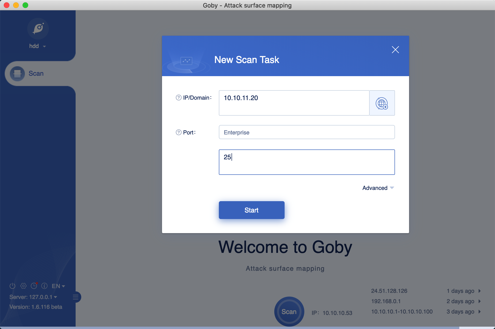
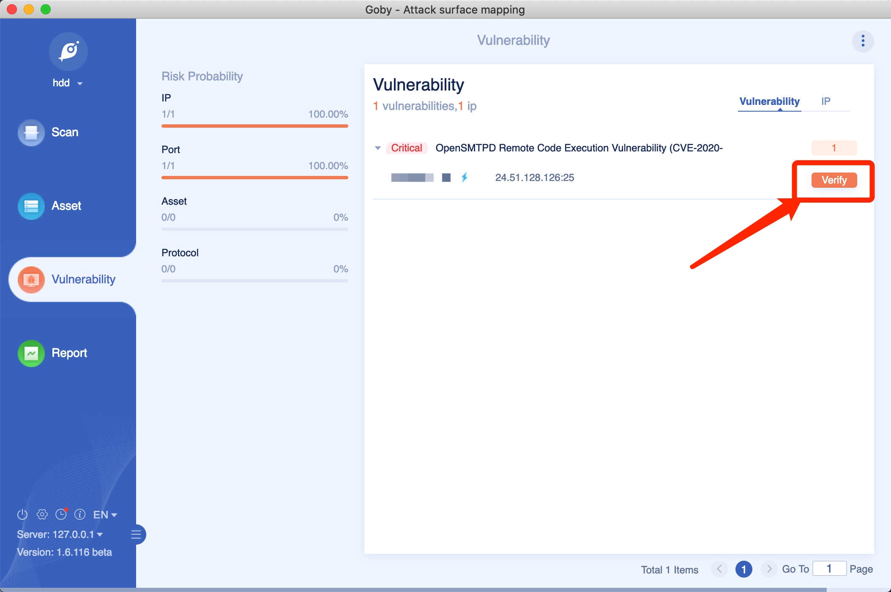

# GobyVuls
[Vulnerabilities](vulnerability_list.md) of Goby supported with exploitation.

This folder contains a variety of vulnerability exploitations for working with goby. 

## Running an explotation
Download goby from [release page](https://github.com/gobysec/Goby/releases), and run.
### Scan ips which may exist the vulnerability

### Click "verify" button

### Do some action like execute cmd, or get a reverse shell

## Contributing
Pull Requests and contributions to this project are encouraged and greatly welcomed! The goby project always needs new vulnerabilities, and needs talented developers (such as yourself!) to submit fixes for the existing demos when they break.

## Download

You can go to the official website to download [Goby](https://gobies.org/ "Goby").
