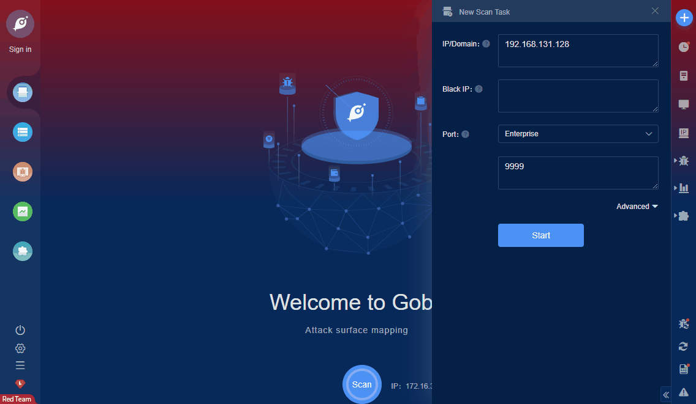

# Sahi pro 7.x 8.x Arbitrary File Read (CVE-2018-20470)

An issue was discovered in Tyto Sahi Pro through 7.x.x and 8.0.0. A directory traversal (arbitrary file access) vulnerability exists in the web reports module. This allows an outside attacker to view contents of sensitive files.

**FOFA query rule**: [body="_s_/spr/" || "sahisid" || title="Sahi Launcher"](https://fofa.so/result?qbase64=Ym9keT0iX3NfL3Nwci8iIHx8ICJzYWhpc2lkIiB8fCB0aXRsZT0iU2FoaSBMYXVuY2hlciI%3D)

# Demo

