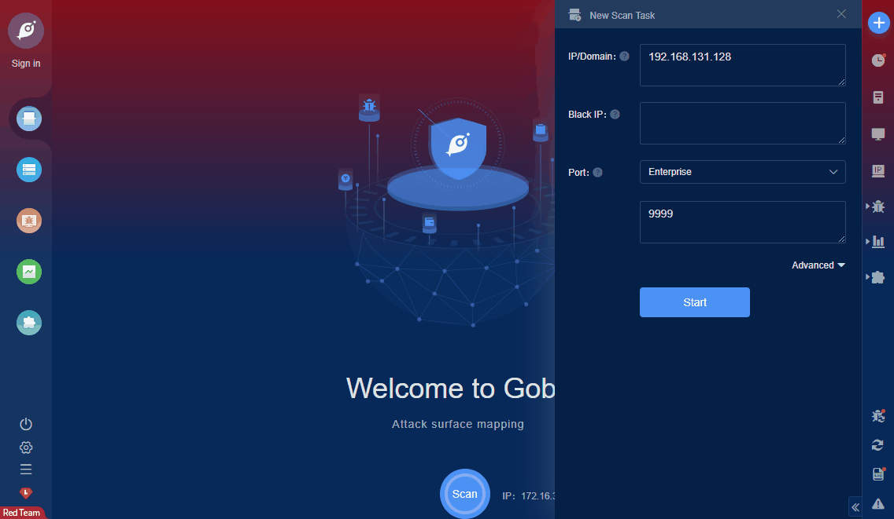

# Sahi Pro v8.x RCE (CVE-2019-13597)

`_s_/sprm/_s_/dyn/Player_setScriptFile` in Sahi Pro 8.0.0 allows command execution. It allows one to run .sah scripts via Sahi Launcher. Also, one can create a new script with an editor. It is possible to execute commands on the server using the _execute() function.

**FOFA query rule**: [body="_s_/spr/" || "sahisid" || title="Sahi Launcher"](https://fofa.so/result?qbase64=Ym9keT0iX3NfL3Nwci8iIHx8ICJzYWhpc2lkIiB8fCB0aXRsZT0iU2FoaSBMYXVuY2hlciI%3D)

# Demo

