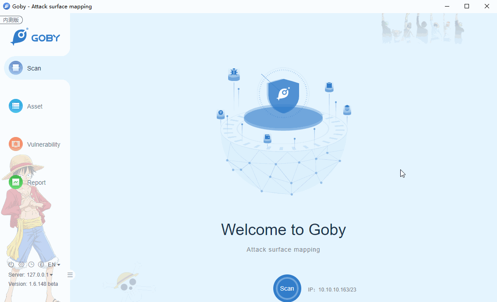

# CVE-2020-11651 RCE Vulnerability

An issue was discovered in SaltStack Salt before 2019.2.4 and 3000 before 3000.2. The salt-master process ClearFuncs class does not properly validate method calls. This allows a remote user to access some methods without authentication. These methods can be used to retrieve user tokens from the salt master and/or run arbitrary commands on salt minions.

**Affected version**: SaltStack Salt < 2019.2.4, 3000 - 3000.2

**[FOFA](https://fofa.so/result?qbase64=YXBwPSJTYWx0U3RhY2si) query rule**: app="SaltStack"

# Demo

