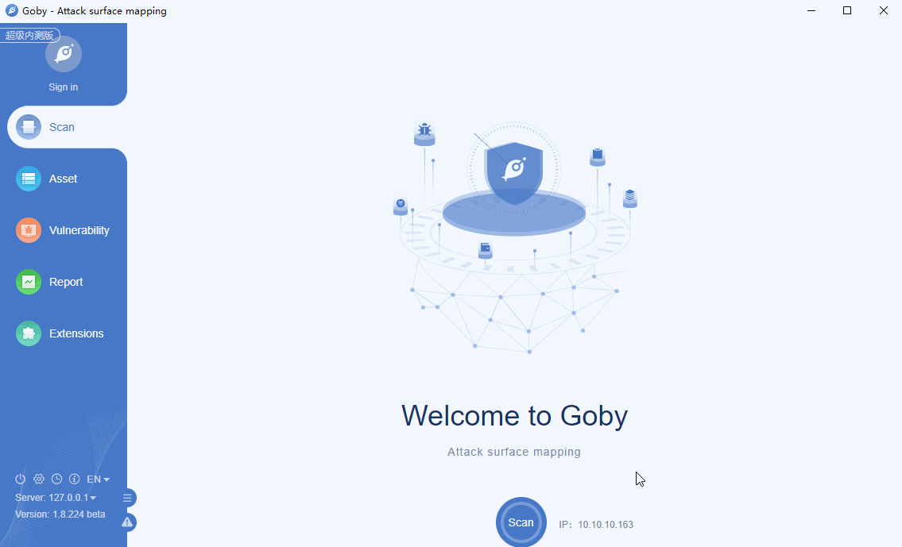

# CVE-2020-16846 SaltStack RCE Vulnerability

An issue was discovered in SaltStack Salt through 3002. Sending crafted web requests to the Salt API, with the SSH client enabled, can result in shell injection.

**Affected version**: SaltStack Salt < 3002

**[FOFA](https://fofa.so/result?q=header%3D%22application%2Fjson%22+%26%26+header%3D%22CherryPy%22+%26%26+body%3D%22clients%22&qbase64=aGVhZGVyPSJhcHBsaWNhdGlvbi9qc29uIiAmJiBoZWFkZXI9IkNoZXJyeVB5IiAmJiBib2R5PSJjbGllbnRzIg%3D%3D&file=&file=) query rule**: header="application/json" && header="CherryPy" && body="clients"

# Demo

