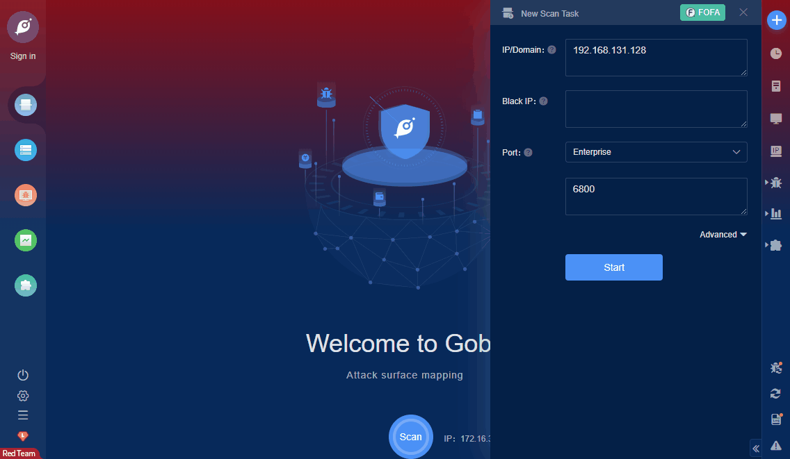

# Scrapyd Unauthorized Access RCE

Scrapyd is a cloud service provided by the crawler framework scrapy. Users can deploy their own scrapy package to the cloud service, which is listening on port 6800 by default. If an attacker can access this port, he will be able to deploy malicious code to the server and gain server permissions.

**FOFA query rule**: [title=="Scrapyd"](https://fofa.so/result?qbase64=dGl0bGU9PSJTY3JhcHlkIg%3D%3D)

# Demo

