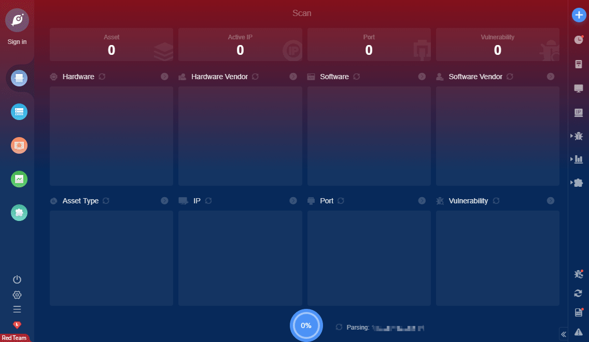

# Seeyon OA Fastjson loginController.do RCE

The old version of Seeyon OA software (below V8.0, V8.0 was released on June 11, 2020) integrated Fastjson component has a deserialization vulnerability

**Affected Version**: 

```json
Seeyon OA V7.1、V7.1SP1

Seeyon OA V7.0、V7.0SP1、V7.0SP2、V7.0SP3

Seeyon OA V6.1、V6.1SP1、V6.1SP2

Seeyon V6.0、V6.0SP1

Seeyon V5.6、V5.6SP1
```


**FOFA query rule**: [app="致远互联-OA"](https://fofa.so/result?qbase64=YXBwPSLoh7Tov5zkupLogZQtT0Ei)

# Demo

