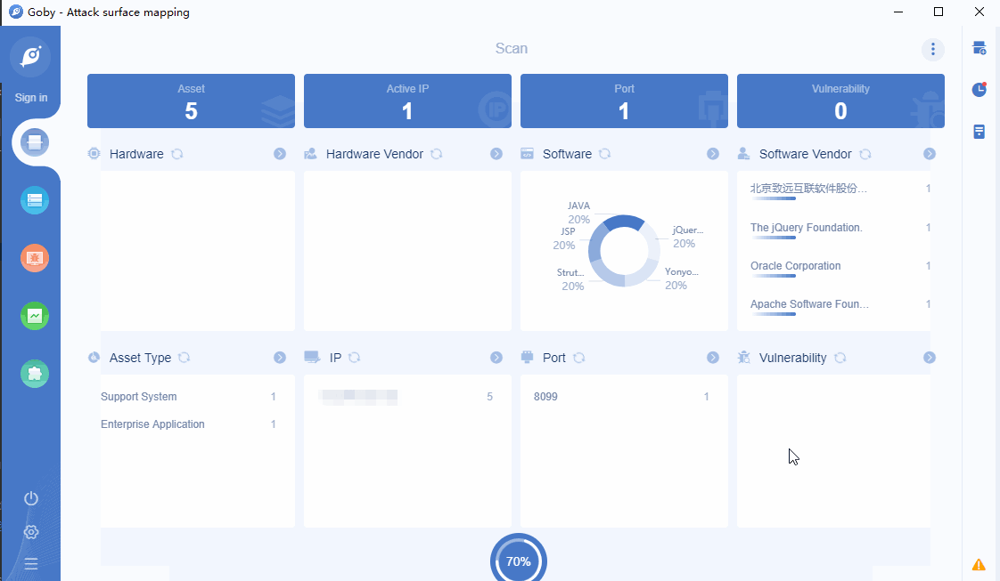

# Seeyon OA htmlofficeservlet upload file getshell

致远是从事OA办公自动化软件的开发销售与服务工作，致远OA在国内使用广泛。该漏洞可造成任意文件上传，恶意攻击者通过精心构造POST数据来上传JSP Webshell，提升服务器权限，从而控制服务器或对系统造成破坏。

**Affected version**: 致远A8-V5协同管理软件 V6.1sp1、致远A8+协同管理软件 

**[FOFA](https://fofa.so/result?qbase64=YXBwPSJZb255b3UtU2VleW9uLU9BIiB8fCBhcHA9IlNlZXlvbi1TZXJ2ZXIi) query rule**: app="Yonyou-Seeyon-OA" || app="Seeyon-Server"

# Demo

