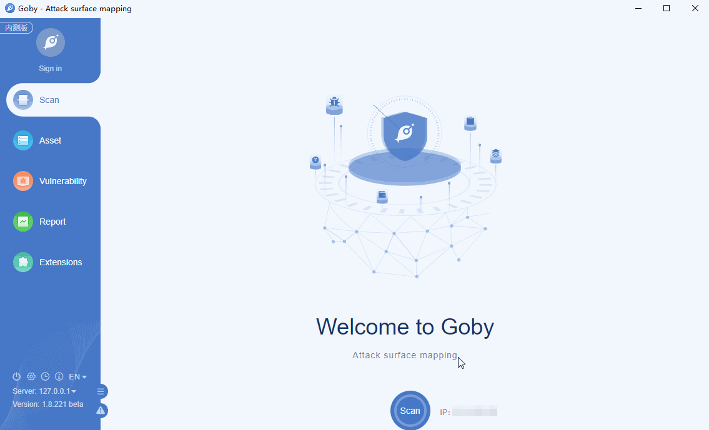

# CVE-2019-0604 Microsoft SharePoint RCE Vulnerability

A remote code execution vulnerability exists in Microsoft SharePoint when the software fails to check the source markup of an application package, aka 'Microsoft SharePoint Remote Code Execution Vulnerability'. This CVE ID is unique from CVE-2019-0594.

**Affected version**: sharepoint_enterprise_server:2016, sharepoint_foundation:2013:sp1, sharepoint_server:2010:sp2, sharepoint_server:2019

**[FOFA](https://fofa.so/result?q=app%3D%22Microsoft-SharePoint%22&qbase64=YXBwPSJNaWNyb3NvZnQtU2hhcmVQb2ludCI%3D&file=&file=) query rule**: app="Microsoft-SharePoint"

# Demo

