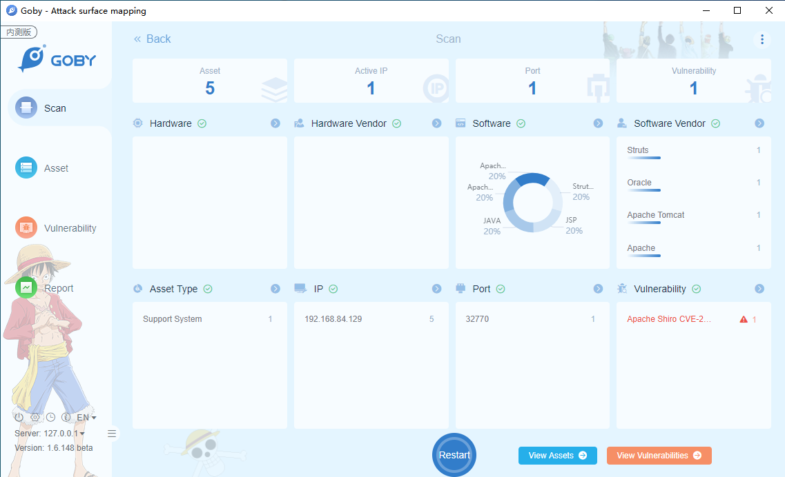
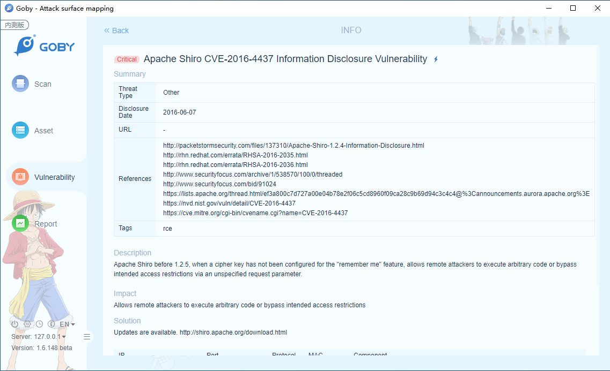

# CVE-2016-4437 Apache Shiro Deserialization Vulnerability

Apache Shiro before 1.2.5, when a cipher key has not been configured for the "remember me" feature, allows remote attackers to execute arbitrary code or bypass intended access restrictions via an unspecified request parameter.

**Affected Version**: Apache Shiro < 1.2.5

**[FOFA](https://fofa.so/result?qbase64=YXBwPSJBcGFjaGUtU2hpcm8i) query rule**: app="Apache-Shiro"

# Demo

