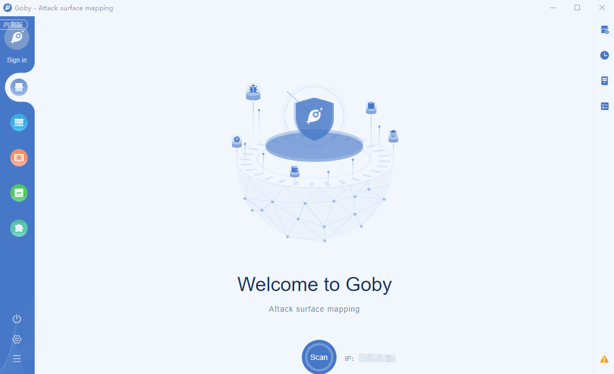

# CVE-2020-10148 SolarWinds Orion Local File Disclosure

The SolarWinds Orion API is vulnerable to an authentication bypass that could allow a remote attacker to execute API commands. This vulnerability could allow a remote attacker to bypass authentication and execute API commands which may result in a compromise of the SolarWinds instance. SolarWinds Orion Platform versions 2019.4 HF 5, 2020.2 with no hotfix installed, and 2020.2 HF 1 are affected.

**[FOFA](https://fofa.so/result?q=app%3D%22Solarwinds-Traffic-Management%22&qbase64=YXBwPSJTb2xhcndpbmRzLVRyYWZmaWMtTWFuYWdlbWVudCI%3D&file=&file=) query rule**: app="Solarwinds-Traffic-Management"

# Demo

