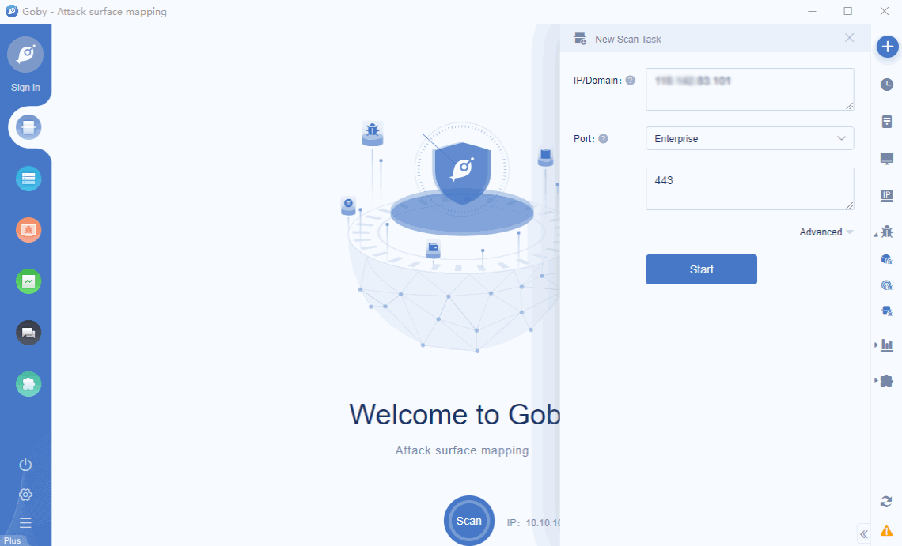

# SonicWall SSL-VPN RCE

There are vulnerabilities in the historical version of SonicWall SSL-VPN. Remote attackers use CGI programs to handle logic vulnerabilities and construct malicious User-Agents, which can cause remote arbitrary command execution and gain host control authority.

**[FOFA](https://fofa.so/result?q=app%3D%22SonicWALL-SSL-VPN%22&qbase64=YXBwPSJTb25pY1dBTEwtU1NMLVZQTiI%3D&file=&file=) query rule**: app="SonicWALL-SSL-VPN"

# Demo

