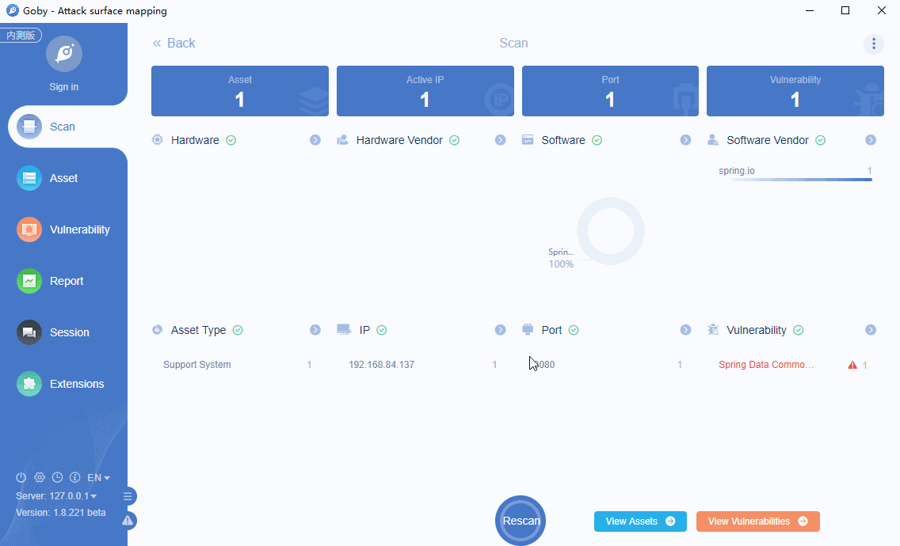

# CVE-2018-1273 Spring Data Commons RCE

Spring Data Commons, versions prior to 1.13 to 1.13.10, 2.0 to 2.0.5, and older unsupported versions, contain a property binder vulnerability caused by improper neutralization of special elements. An unauthenticated remote malicious user (or attacker) can supply specially crafted request parameters against Spring Data REST backed HTTP resources or using Spring Data's projection-based request payload binding hat can lead to a remote code execution attack.

**Affected Version**: Spring Data Commons 1.13 - 1.13.10, 2.0 - 2.0.5, older unsupported versions

**[FOFA](https://fofa.so/result?qbase64=YXBwPSJTcHJpbmdCb290Ig%3D%3D) query rule**: app="SpringBoot"

# Demo

