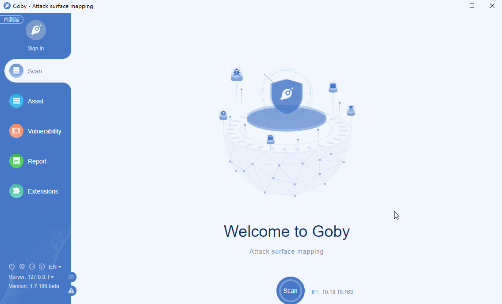

# CVE-2020-5410 Spring Cloud Config Server Directory Traversal

Spring Cloud Config, versions 2.2.x prior to 2.2.3, versions 2.1.x prior to 2.1.9, and older unsupported versions allow applications to serve arbitrary configuration files through the spring-cloud-config-server module. A malicious user, or attacker, can send a request using a specially crafted URL that can lead to a directory traversal attack.

**Affected Version**: Spring Cloud Config 2.2.x - 2.2.3, 2.1.x - 2.1.9, older unsupported versions

**[FOFA](https://fofa.so/result?qbase64=YXBwPSJTcHJpbmdCb290Ig%3D%3D) query rule**: app="SpringBoot"

# Demo

