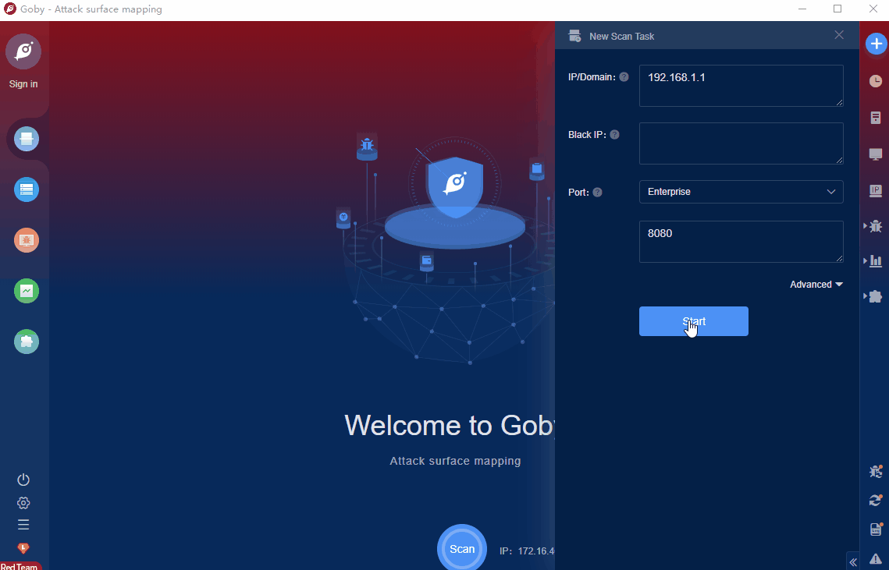

# Spring Cloud Gateway Actuator API SpEL Code Injection (CVE-2022-22947)

Spring Cloud Gateway is the second-generation gateway framework officially launched by Spring Cloud, replacing the Zuul gateway. As the traffic, the gateway plays a very important role in the microservice system. The common functions of the gateway include routing and forwarding, permission verification, and current limiting control. Applications using Spring Cloud Gateway in the version prior to 3.1.0 and 3.0.6, are vulnerable to a code injection attack when the Gateway Actuator endpoint is enabled, exposed and unsecured. A remote attacker could make a maliciously crafted request that could allow arbitrary remote execution on the remote host.

FOFA **query rule**: [app="Spring-GW"](https://fofa.info/result?qbase64=YXBwPSJTcHJpbmctR1ci)

# Demo

