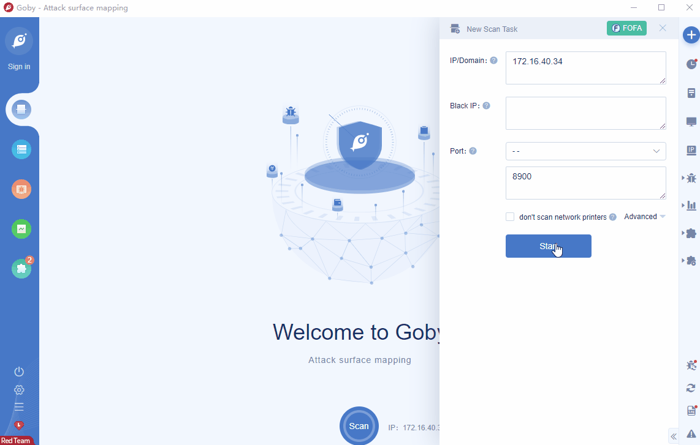

# Spring Core Framework Remote Code Execution Vulnerability(CVE-2022-22965)

Spring core is a toolkit for discovering, creating and processing the relationship between beans in the Spring series.An unauthenticated attacker could use this vulnerability for remote arbitrary code execution. The vulnerability exists widely in the Spring framework and derived frameworks, and JDK 9.0 and above will be affected. Products using older JDK versions are not affected.

FOFA **query rule**: [app="APACHE-Tomcat" || app="vmware-SpringBoot-framework" || app="vmware-SpringBoot-framework" || app="vmware-Spring-Batch" || app="vmware-Spring-framework" || app="vmware-Spring-Security"](https://fofa.info/result?qbase64=YXBwPSJBUEFDSEUtVG9tY2F0IiB8fCBhcHA9InZtd2FyZS1TcHJpbmdCb290LUZyYW1ld29yayJ8fGFwcD0idm13YXJlLVNwcmluZ0Jvb3QtRnJhbWV3b3JrInx8YXBwPSJ2bXdhcmUtU3ByaW5nLUJhdGNoInx8YXBwPSJ2bXdhcmUtU3ByaW5nLUZyYW1ld29yayJ8fGFwcD0idm13YXJlLVNwcmluZy1TZWN1cml0eSI%3D)

# Demo

