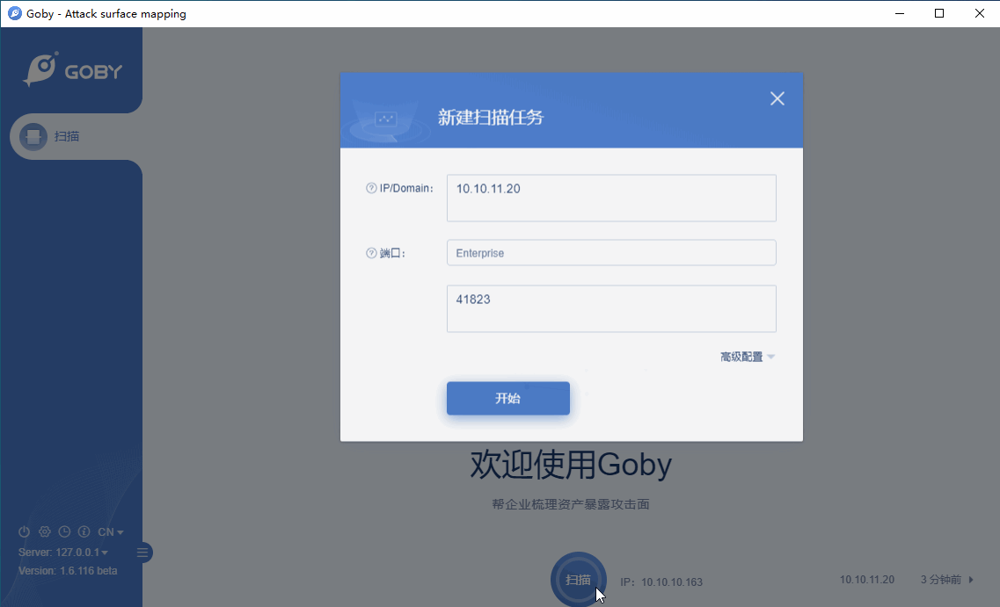

# S2-016 (CVE-2013-2251) Remote Code Execution Vulnerability

Apache Struts 2.0.0 through 2.3.15 allows remote attackers to execute arbitrary OGNL expressions via a parameter with a crafted (1) action:, (2) redirect:, or (3) redirectAction: prefix.

**Affected Version**: Apache Struts2 2.0.0 - 2.3.15

**[FOFA](https://fofa.so/result?qbase64=YXBwPSJTdHJ1dHMyIg%3D%3D) query rule**: app="Struts2"

# Demo

