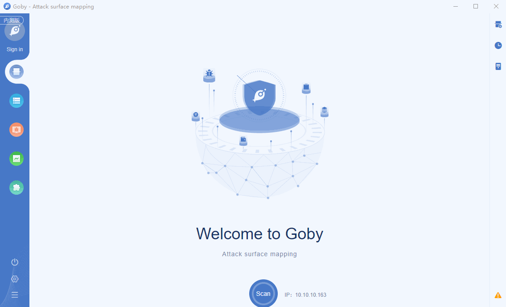

# S2-061 (CVE-2020-17530) Remote Code Execution Vulnerability

Forced OGNL evaluation, when evaluated on raw user input in tag attributes, may lead to remote code execution. Affected software : Apache Struts 2.0.0 - Struts 2.5.25.

**Affected version**: Apache Struts 2.0.0 - Struts 2.5.25

**[FOFA](https://fofa.so/result?qbase64=YXBwPSJTdHJ1dHMyIg%3D%3D) query rule**: app="Struts2"

# Demo

