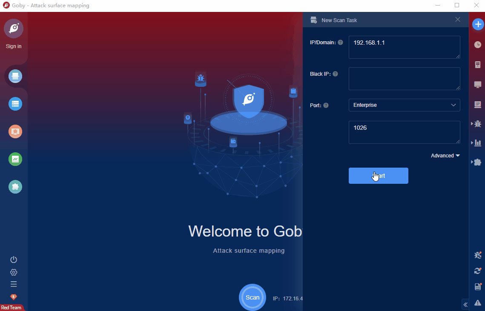

# SunloginClient ping RCE (CNVD-2022-10270)

Sunflower remote control software is a free integrated remote control management tool software that integrates remote control of computer mobile phones, remote desktop connection, remote boot, remote management, and support for intranet penetration.There is a remote execution vulnerability in the ping parameter of the Sunflower remote control software, and attackers can use the vulnerability to execute arbitrary commands to control server permissions.

FOFA **query rule**: [body="Verification failure"](https://fofa.info/result?qbase64=Ym9keT0iVmVyaWZpY2F0aW9uIGZhaWx1cmUi)

# Demo

