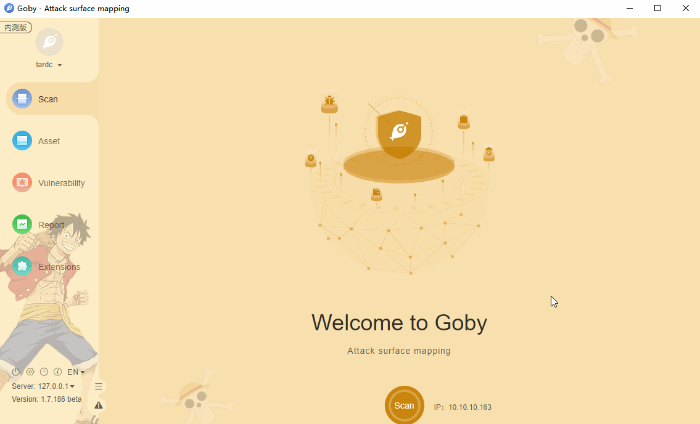

# CVE-2017-11610 Supervisor XML-RPC Authenticated Remote Code Execution

The XML-RPC server in supervisor before 3.0.1, 3.1.x before 3.1.4, 3.2.x before 3.2.4, and 3.3.x before 3.3.3 allows remote authenticated users to execute arbitrary commands via a crafted XML-RPC request, related to nested supervisord namespace lookups.

**Affected version**: supervisor < 3.0.1, 3.1.x - 3.1.4, 3.2.x - 3.2.4, 3.3.x - 3.3.3

**[FOFA](https://fofa.so/result?qbase64=YXBwPSJCRUEtV2ViTG9naWMtU2VydmVyIg%3D%3D) query rule**: app="supervisord" || title="Supervisor Status"

# Demo

