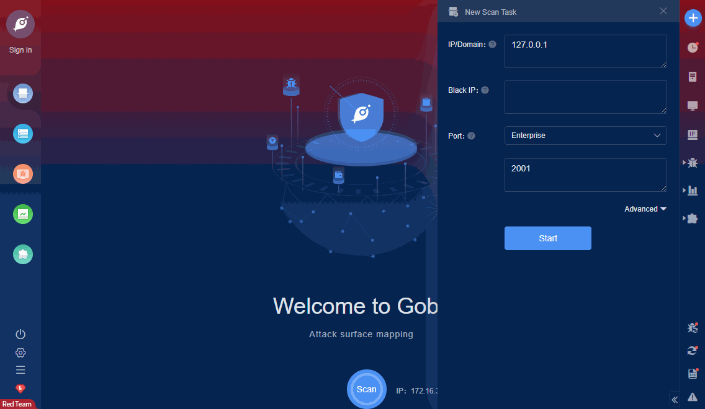

# TCExam 14.8.1 Information leakage (CVE-2021-20114)

When installed following the default/recommended settings, TCExam <= 14.8.1 allowed unauthenticated users to access the /cache/backup/ directory, which included sensitive database backup files.

FOFA **query rule**: [app="TCExam"](https://fofa.so/result?qbase64=YXBwPSJUQ0V4YW0i)

# Demo

