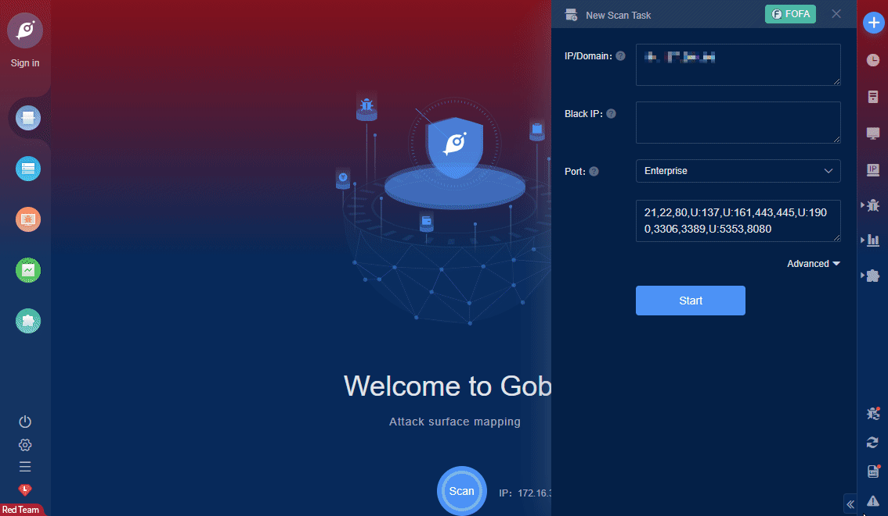

# Progress Telerik UI for ASP.NET AJAX Deserialization (CVE-2019-18935)

Progress Telerik UI for ASP.NET AJAX through 2019.3.1023 contains a .NET deserialization vulnerability in the RadAsyncUpload function. This is exploitable when the encryption keys are known due to the presence of CVE-2017-11317 or CVE-2017-11357, or other means. Exploitation can result in remote code execution. (As of 2020.1.114, a default setting prevents the exploit. In 2019.3.1023, but not earlier versions, a non-default setting can prevent exploitation.)

**FOFA query rule**: [app="Progress-Telerik-Sitefinity"](https://fofa.so/result?qbase64=YXBwPSJQcm9ncmVzcy1UZWxlcmlrLVNpdGVmaW5pdHki)

# Demo

