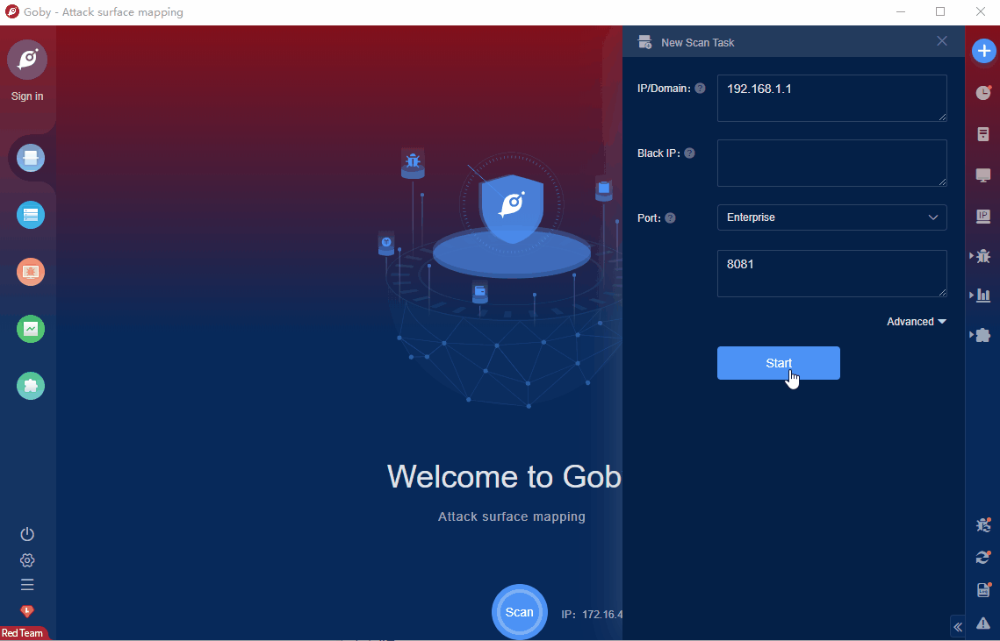

# Tenda Auth uploadWewifiPic RCE

Tenda router is an efficient and practical router. There is a command execution vulnerability in the uploadWewifiPic route in the background of Tenda routers. Attackers can use the vulnerability to execute arbitrary commands to obtain server permissions.

FOFA **query rule**: [body="Tenda|登录" && body="tenda.css"](https://fofa.info/result?qbase64=Ym9keT0iVGVuZGF855m75b2VIiAmJiBib2R5PSJ0ZW5kYS5jc3Mi)

# Demo

