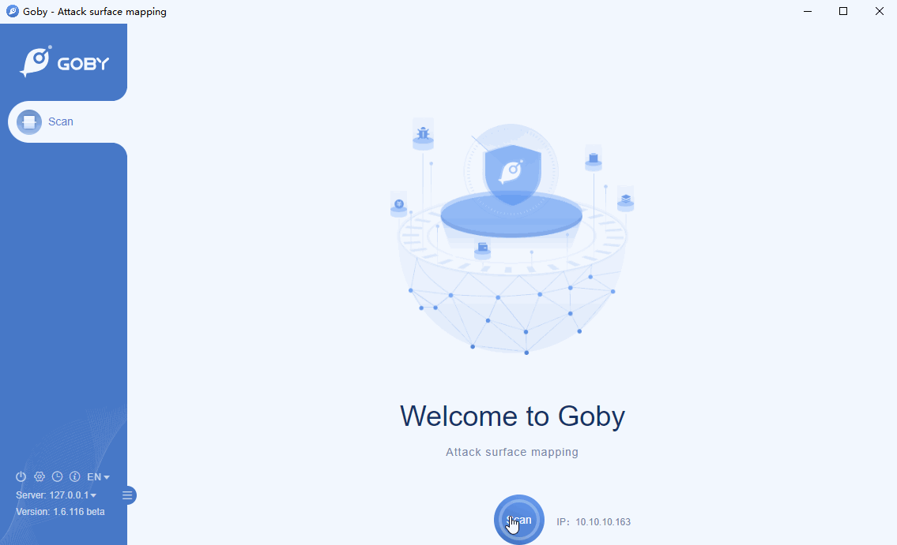

# ThinkPHP 2.1 Remote Code Execution Vulnerability

ThinkPHP was born in 2006, is a open source PHP development framework, which draws on the Action object of the Struts framework, and also uses the object-oriented development structure and MVC model. ThinkPHP can run on operating systems such as Windows and Linux. It supports multiple databases such as MySql, Sqlite, and PostgreSQL, and PDO extensions. It is a cross-platform, cross-version, and easy-to-use PHP framework.

In ThinkPHP version 2.1, `/e` pattern of `preg_replace` is used to match routes:

```php
$res = preg_replace('@(\w+)'.$depr.'([^'.$depr.'\/]+)@e', '$var[\'\\1\']="\\2";', implode($depr,$paths));
```

This is a very dangerous parameter. If this parameter is used, the second parameter of `preg_replace` will be executed as PHP code.

**Affected version**: ThinkPHP 2.1

**[FOFA](https://fofa.so/result?qbase64=YXBwPSJUaGlua1BIUCI%3D) query rule**: app="ThinkPHP"

# Demo

