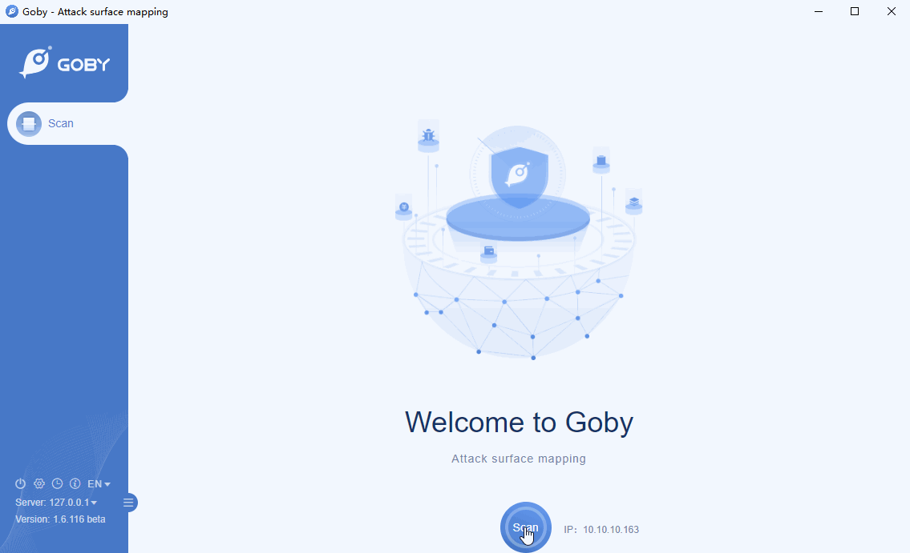

# ThinkPHP 5.x Remote Code Execution Vulnerability

ThinkPHP was born in 2006, is a open source PHP development framework, which draws on the Action object of the Struts framework, and also uses the object-oriented development structure and MVC model. ThinkPHP can run on operating systems such as Windows and Linux. It supports multiple databases such as MySql, Sqlite, and PostgreSQL, and PDO extensions. It is a cross-platform, cross-version, and easy-to-use PHP framework.

In ThinkPHP 5, because the framework does not perform sufficient detection on the controller name, it will lead to remote code execution without enabling mandatory routing.

**Affected version**: ThinkPHP 5.x

**[FOFA](https://fofa.so/result?qbase64=YXBwPSJUaGlua1BIUCI%3D) query rule**: app="ThinkPHP"

# Demo

