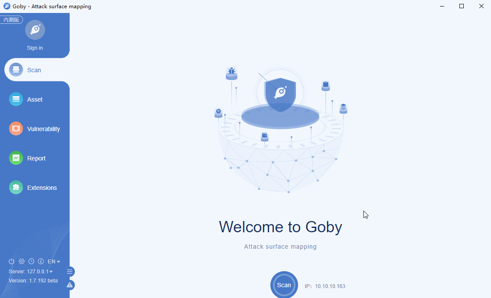

# Tongda OA any file delete getshell

Attackers can obtain server system permissions through file deletion vulnerability and file upload vulnerability of earlier versions.

**Affected version**: Tongda OA 11.6

**[FOFA](https://fofa.so/result?q=app%3D"TongDa-OA"&qbase64=YXBwPSJUb25nRGEtT0Ei) query rule**: app="TongDa-OA"

# Demo

