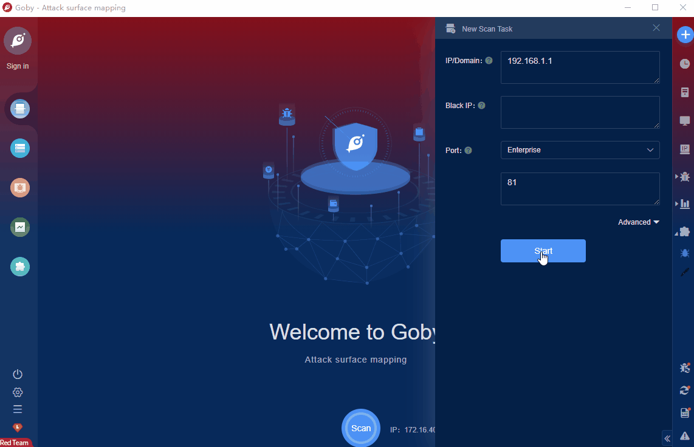

# UNV ip camera RCE (CNVD-2020-31565)

As a leading security camera service provider, Uniview can meet your security needs in different scenarios. Our IP cameras renders high-quality images even in low illumination environment while featuring smart functions based on video content analytics, and minimizing bandwidth and storage. The most important business value of them is to provide excellent performance at an affordable price.There is a RCE vulnerability in UNV ip camera.Attackers can exploit this vulnerability to get shell.

FOFA **query rule**: [body="Alarm" && body="白牌定制"](https://fofa.info/result?qbase64=Ym9keT0iQWxhcm0iICYmIGJvZHk9IueZveeJjOWumuWItiI%3D)

# Demo

