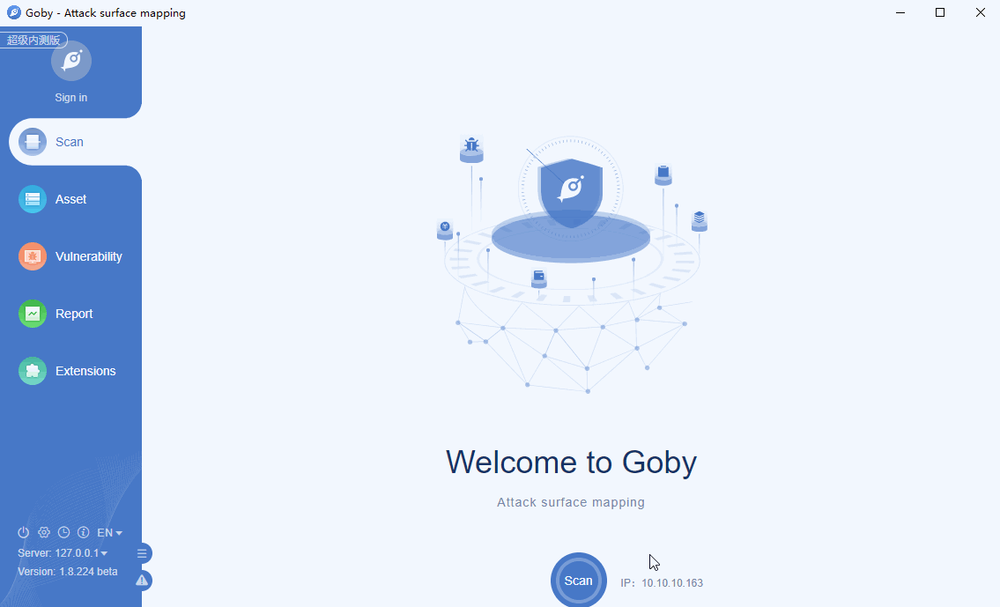

# CVE-2020-13942 Apache Unomi RCE

Apache Unomi allows conditions to use OGNL and MVEL scripting which offers the possibility to call static Java classes from the JDK that could execute code with the permission level of the running Java process.

**Affected version**: Apache Unomi <= 1.5.1

**[FOFA](https://fofa.so/result?q=title%3D%22Apache+Unomi+Welcome+Page%22&qbase64=dGl0bGU9IkFwYWNoZSBVbm9taSBXZWxjb21lIFBhZ2Ui&file=&file=) query rule**: title="Apache Unomi Welcome Page"

# Demo

