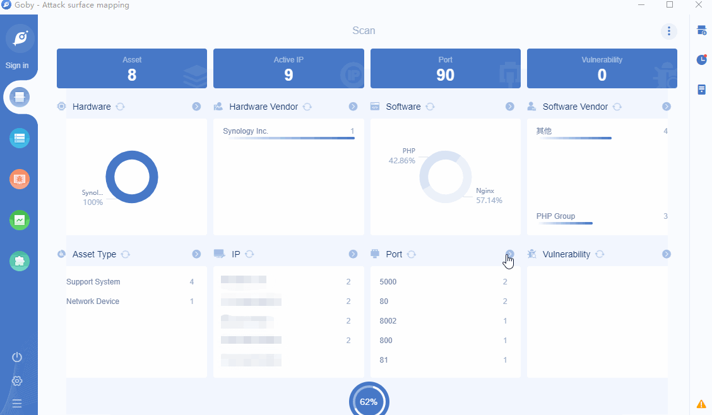

# CVE-2020-5847 Unraid 6.8.0 authenticate bypass remote code execution

Unraid是一套主要用于个人和小型企业的操作系统。Unraid 6.8.0及之前版本中存在安全漏洞。攻击者可利用该漏洞绕过访问控制并执行代码，从而获取服务器权限。

**Affected version**: Unraid <= 6.8.0

**[FOFA](https://fofa.so/result?qbase64=Ym9keT0iL3dlYkd1aS9pbWFnZXMvZ3JlZW4tb24ucG5nIg) query rule**: body="/webGui/images/green-on.png"

# Demo

