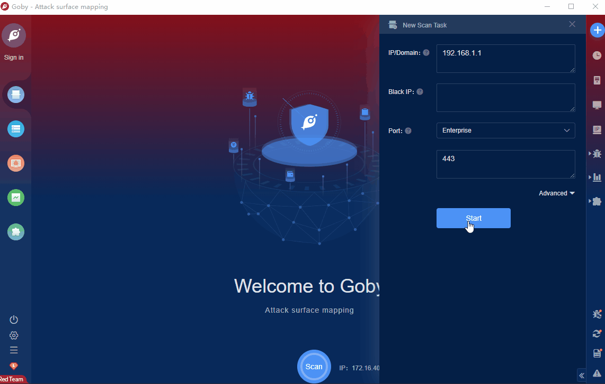

# VMware Workspace ONE Access & Identity Manager Remote Code Execution (CVE-2022-22954)

VMware Workspace ONE is an intelligence-driven digital workspace platform that lets you deliver and manage applications anywhere, anytime, on any device, in a simple and secure way. VMware workspace one access and Identity Manager have a remote command execution vulnerability caused by server template injection, which can be exploited by unauthenticated attackers for remote arbitrary code execution.

FOFA **query rule**: [app="vmware-Workspace-ONE-Access" || app="vmware-Identity-Manager"](https://fofa.info/result?qbase64=YXBwPSJ2bXdhcmUtV29ya3NwYWNlLU9ORS1BY2Nlc3MifHxhcHA9InZtd2FyZS1JZGVudGl0eS1NYW5hZ2VyIg%3D%3D)

# Demo

