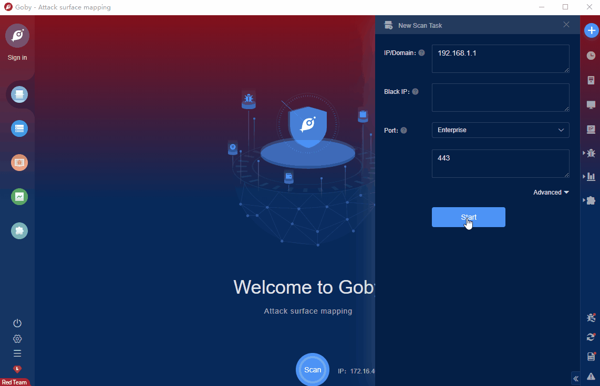

# VMware Workspace ONE Access & Identity Manager Authentication Bypass Vulnerability (CVE-2022-22972)

Workspace ONE Access is an intelligence-driven digital workspace platform developed by VMware that enables easy and secure delivery and management of any application on any device, anytime, anywhere. Identity Manager (vIDM for short) is a powerful identity management system developed by VMware. vRealize Automation is a modern infrastructure automation platform designed to help businesses achieve self-service and multi-cloud automation.VMware Workspace ONE Access, Identity Manager and vRealize Automation contain an authentication bypass vulnerability affecting local domain users.

FOFA **query rule**: [app="vmware-Workspace-ONE-Access"](https://fofa.info/result?qbase64=YXBwPSJ2bXdhcmUtV29ya3NwYWNlLU9ORS1BY2Nlc3Mi)

# Demo

