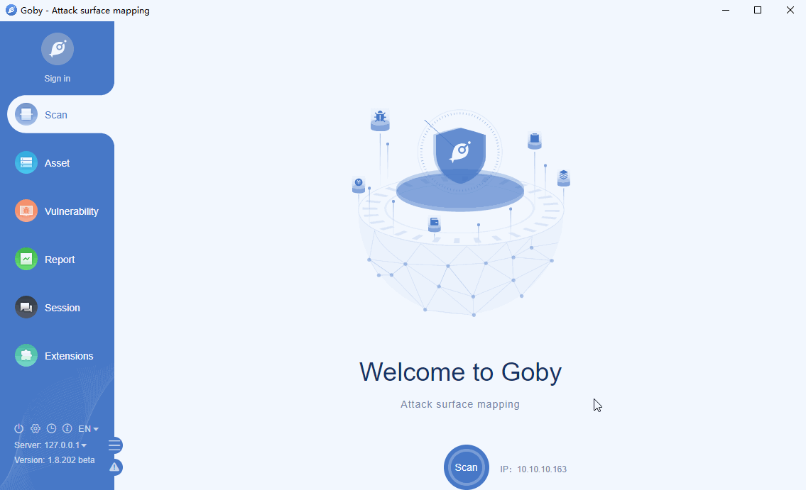

# VMware vCenter Arbitrary File Read

VMware vCenter Server is advanced server management software that provides a centralized platform for controlling your VMware vSphere environments, allowing you to automate and deliver a virtual infrastructure across the hybrid cloud with confidence. A remote attacker who successfully exploited this vulnerability can read arbitrary files on the target system.

**Affected version**: VMware vCenter 6.5.0

**[FOFA](https://fofa.so/result?q=app%3D%22VMware-vCenter%22+%7C%7C+app%3D%22VMware-VirtualCenter%22&qbase64=YXBwPSJWTXdhcmUtdkNlbnRlciIgfHwgYXBwPSJWTXdhcmUtVmlydHVhbENlbnRlciI%3D&file=&file=) query rule**: app="VMware-VirtualCenter" || app="VMware-vCenter"

# Demo

