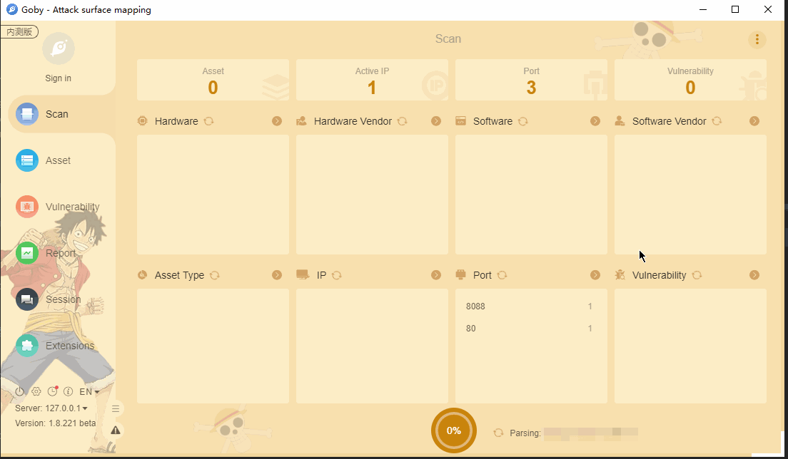

# Weaver e-Bridge File Read

泛微云桥（e-Bridge）是上海泛微公司在”互联网+”的背景下研发的一款用于桥接互联网开放资源与企业信息化系统的系统集成中间件。泛微云桥存在任意文件读取漏洞，攻击者成功利用该漏洞，可实现任意文件读取，获取敏感信息。

**[FOFA](https://fofa.so/result?qbase64=YXBwPSJXZWF2ZXItZS1CcmlkZ2Ui) query rule**: app="Weaver-e-Bridge"

# Demo

