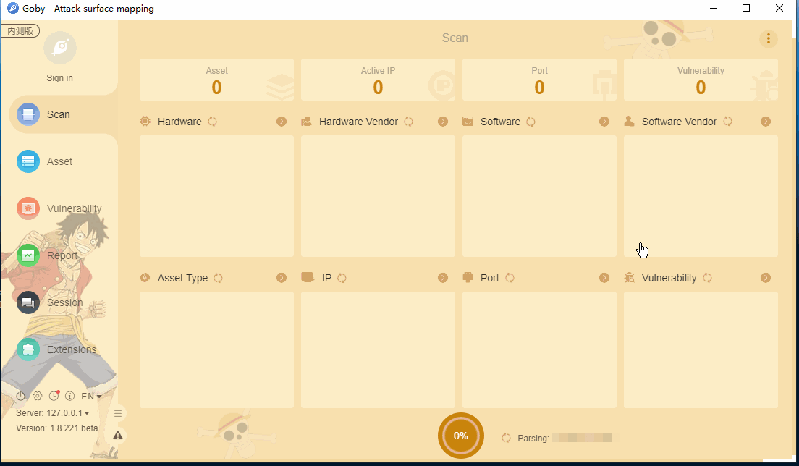

# weblogic t3 CVE-2020-14825

Vulnerability in the Oracle WebLogic Server product of Oracle Fusion Middleware (component: Core).  Easily exploitable vulnerability allows unauthenticated attacker with network access via IIOP, T3 to compromise Oracle WebLogic Server. Successful attacks of this vulnerability can result in takeover of Oracle WebLogic Server.

**Affected version**:  12.2.1.3.0, 12.2.1.4.0 and 14.1.1.0.0

**[FOFA](https://fofa.so/result?qbase64=dGl0bGU9PSJFcnJvciA0MDQtLU5vdCBGb3VuZCIgfHwgYXBwPSJPcmFjbGUtV2VibG9naWNQb3J0YWwi) query rule**: title=="Error 404--Not Found" || app="Oracle-WeblogicPortal"

# Demo

