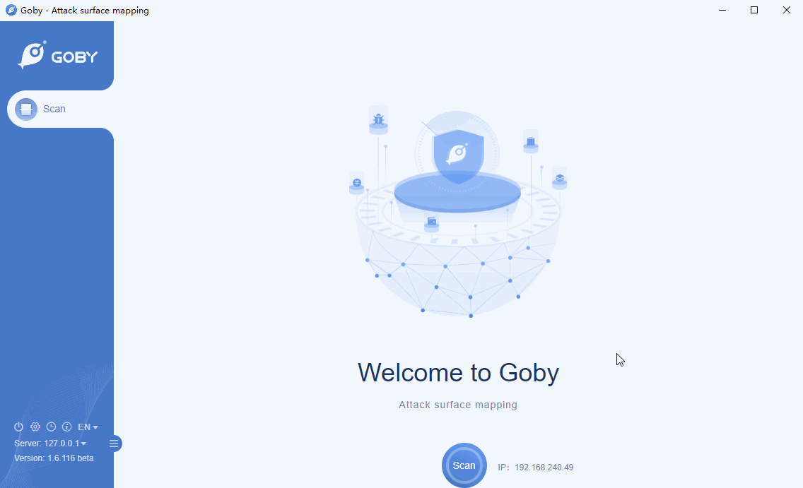

# CVE-2020-2551 WebLogic IIOP Remote Code Execution Vulnerability

Vulnerability in the Oracle WebLogic Server product of Oracle Fusion Middleware (component: WLS Core Components). Supported versions that are affected are 10.3.6.0.0, 12.1.3.0.0, 12.2.1.3.0 and 12.2.1.4.0. Easily exploitable vulnerability allows unauthenticated attacker with network access via IIOP to compromise Oracle WebLogic Server. Successful attacks of this vulnerability can result in takeover of Oracle WebLogic Server. 

**Affected version**: weblogic_server:10.3.6.0.0, 12.1.3.0.0, 12.2.1.3.0, 12.2.1.4.0

**[FOFA](https://fofa.so/result?qbase64=YXBwPSJCRUEtV2ViTG9naWMtU2VydmVyIg%3D%3D) query rule**: app="BEA-WebLogic-Server"

# Demo

