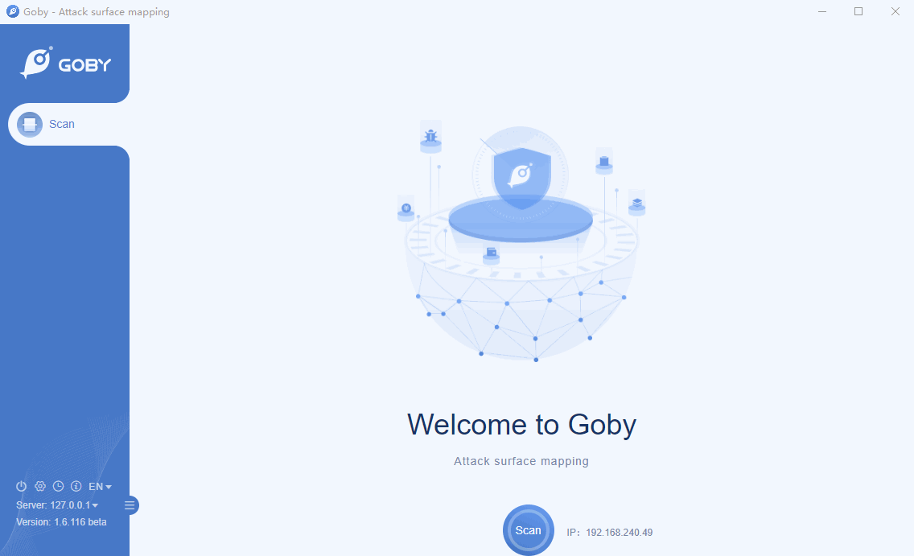

# CVE-2020-2555 WebLogic ReflectionExtractor Remote Code Execution Vulnerability

Vulnerability in the Oracle Coherence product of Oracle Fusion Middleware (component: Caching,CacheStore,Invocation). Supported versions that are affected are 3.7.1.17, 12.1.3.0.0, 12.2.1.3.0 and 12.2.1.4.0. Easily exploitable vulnerability allows unauthenticated attacker with network access via T3 to compromise Oracle Coherence. Successful attacks of this vulnerability can result in takeover of Oracle Coherence.

**Affected version**: Oracle Coherence 3.7.1.17, 12.1.3.0.0, 12.2.1.3.0, 12.2.1.4.0

**[FOFA](https://fofa.so/result?qbase64=YXBwPSJCRUEtV2ViTG9naWMtU2VydmVyIg%3D%3D) query rule**: app="BEA-WebLogic-Server"

# Demo

