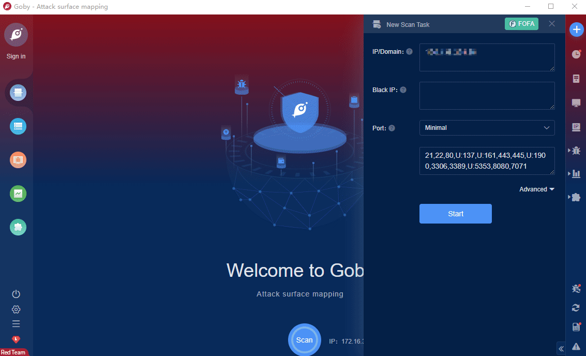

# Weblogic Secondary Deserialization RCE (CVE-2021-2135)

Vulnerability in the Oracle WebLogic Server product of Oracle Fusion Middleware (component: Coherence Container). Supported versions that are affected are 12.1.3.0.0, 12.2.1.3.0, 12.2.1.4.0 and 14.1.1.0.0. Easily exploitable vulnerability allows unauthenticated attacker with network access via T3, IIOP to compromise Oracle WebLogic Server. Successful attacks of this vulnerability can result in takeover of Oracle WebLogic Server. CVSS 3.1 Base Score 9.8 (Confidentiality, Integrity and Availability impacts). CVSS Vector: (CVSS:3.1/AV:N/AC:L/PR:N/UI:N/S:U/C:H/I:H/A:H).

**FOFA query rule**: [app=\"BEA-WebLogic-Server\" || app=\"Weblogic_interface_7001"](https://fofa.so/result?qbase64=YXBwPSJCRUEtV2ViTG9naWMtU2VydmVyIiB8fCBhcHA9IldlYmxvZ2ljX2ludGVyZmFjZV83MDAxIg%3D%3D)

# Demo

