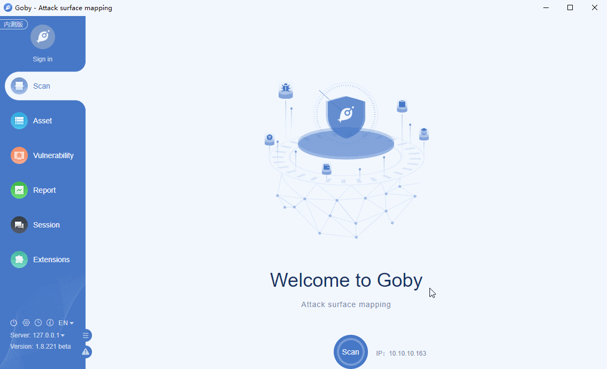

# CVE-2019-15107 Webmin RCE

An issue was discovered in Webmin <=1.920. The parameter old in password_change.cgi contains a command injection vulnerability.

**Affected version**: Webmin <=1.920

**[FOFA](https://fofa.so/result?q=app%3D%22Webmin%22&qbase64=YXBwPSJXZWJtaW4i&file=&file=) query rule**: app="Webmin"

# Demo

