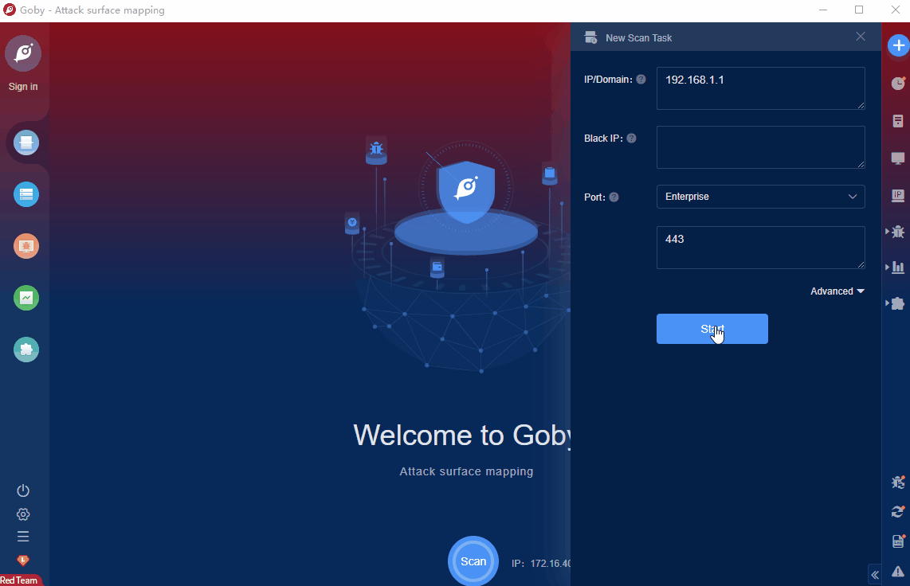

# WordPress WP Live Chat Support Pro Plugin < 8.0.26 Arbitrary File Upload Vulnerability

WordPress is a blogging platform developed by the WordPress Foundation using the PHP language. The platform supports setting up personal blog sites on PHP and MySQL servers. WP Live Chat Support Pro plugin is one of the live chat plugins used in it.A code issue vulnerability exists in the WordPress WP Live Chat Support Pro plugin 8.0.26 and earlier. The vulnerability arises from an improper design or implementation problem in the code development process of the network system or product.

FOFA **query rule**: [body="/wp-content/plugins/wp-live-chat-support/" || app="WordPress"](https://fofa.info/result?qbase64=Ym9keT0iL3dwLWNvbnRlbnQvcGx1Z2lucy93cC1saXZlLWNoYXQtc3VwcG9ydC8iIHx8IGFwcD0iV29yZFByZXNzIg%3D%3D)

# Demo

