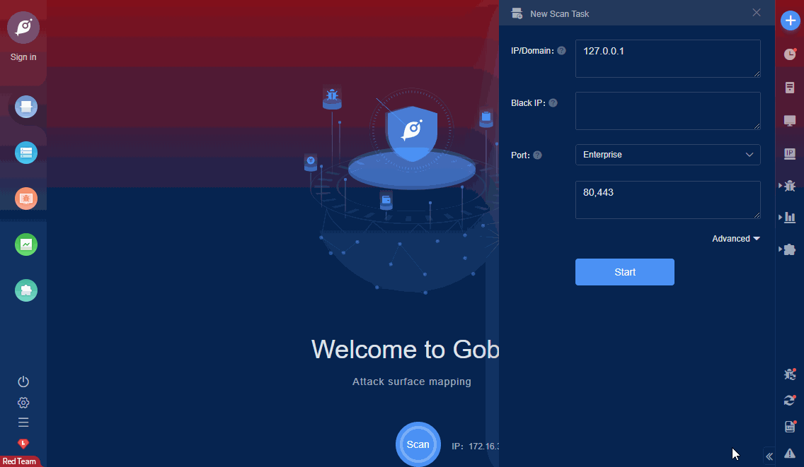

# WordPress Modern Events Calendar Lite file export (CVE-2021-24146)

Lack of authorisation checks in the Modern Events Calendar Lite WordPress plugin, versions before 5.16.5, did not properly restrict access to the export files, allowing unauthenticated users to exports all events data in CSV or XML format for example.

FOFA **query rule**: [app="wordpress"](https://fofa.so/result?qbase64=YXBwPSJ3b3JkcHJlc3Mi)

# Demo

