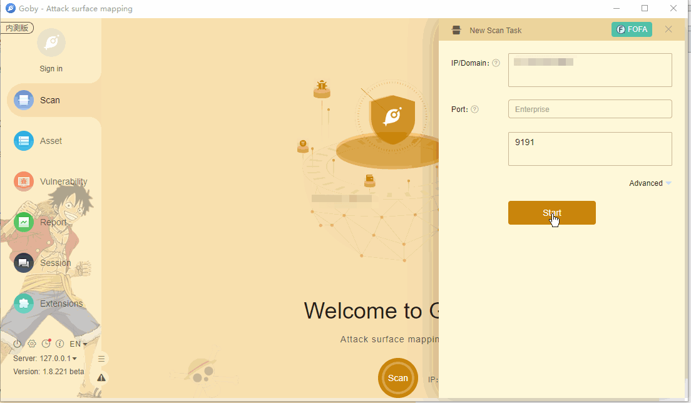

# XXL-JOB API Unauthenticated glueSource RCE

XXL-JOB是一个分布式任务调度平台，其核心设计目标是开发迅速、学习简单、轻量级、易扩展，现已开放源代码并接入多家公司线上产品线，接入场景如电商业务，O2O业务和大数据作业等。

XXL-JOB默认情况下XXL-JOB的API接口没有配置认证措施，未授权的攻击者可构造恶意请求，造成远程执行命令，直接控制服务器。漏洞利用无需登录，实际风险极高。

**[FOFA](https://fofa.so/result?qbase64=Ym9keT0iaW52YWxpZCByZXF1ZXN0LCBIdHRwTWV0aG9kIG5vdCBzdXBwb3J0IiB8fCBib2R5PSJpbnZhbGlkIHJlcXVlc3QsIHVyaS1tYXBwaW5nKC8pIG5vdCBmb3VuZC4i) query rule**: body="invalid request, HttpMethod not support" || body="invalid request, uri-mapping(/) not found."

# Demo

