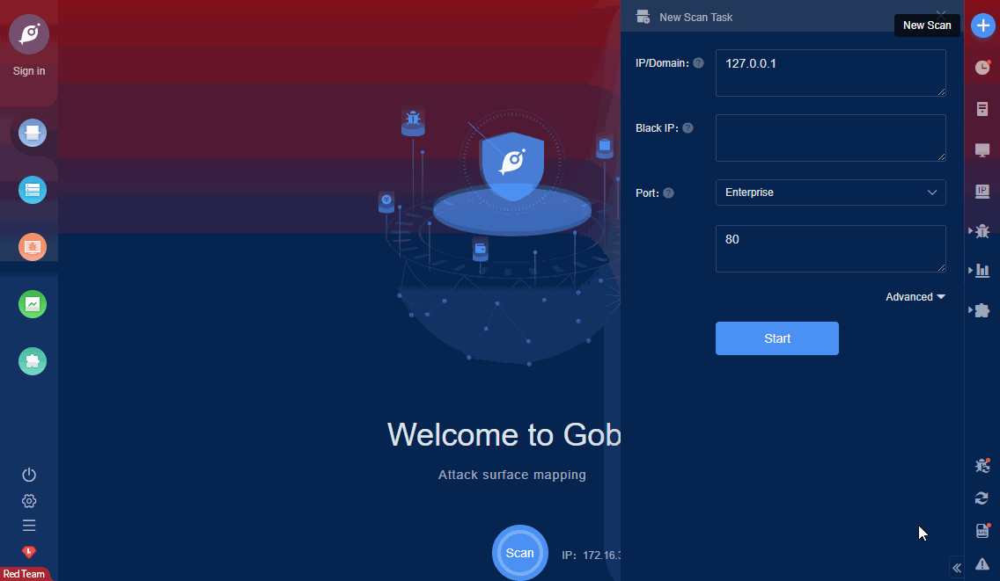

# ZBL EPON ONU Broadband Router 1.0 Remote Privilege Escalation

The limited administrative user admin:admin can elevate her privileges by sending a HTTP GET request to the configuration backup endpoint or the password page and disclose the http super user password. Once authenticated as super, an attacker will be granted access to additional and privileged functionalities.

FOFA **query rule**: [body="HG104B-ZG-E"](https://fofa.so/result?qbase64=Ym9keT0iSEcxMDRCLVpHLUUi)

# Demo

