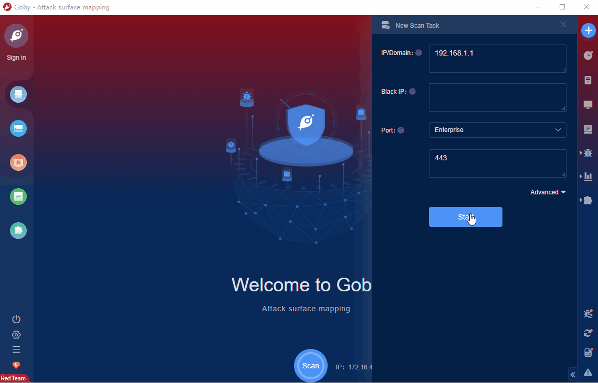

# Zabbix Login Bypass (CVE-2022-23131)

Zabbix is an open source monitoring system. The system supports network monitoring, server monitoring, cloud monitoring and application monitoring, etc. A login bypass vulnerability exists in Zabbix that arises when SAML SSO authentication is enabled (not default). An unauthenticated malicious attacker could exploit the vulnerability to escalate privileges and gain administrator access to the Zabbix frontend.

FOFA **query rule**: [body="SAML" && (banner="zbx_session=" || header="zbx_session=")](https://fofa.info/result?qbase64=Ym9keT0iU0FNTCIgJiYgKGJhbm5lcj0iemJ4X3Nlc3Npb249IiB8fCBoZWFkZXI9InpieF9zZXNzaW9uPSIp)

# Demo

