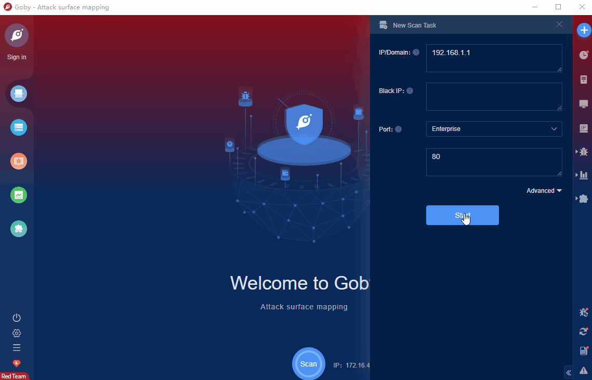

# Zabbix Setup Configuration Unauthenticated Access (CVE-2022-23134)

Zabbix is an open source monitoring system. The system supports network monitoring, server monitoring, cloud monitoring and application monitoring, etc. After the initial setup process, some steps of setup.php file are reachable not only by super-administrators, but by unauthenticated users as well. Malicious actor can pass step checks and potentially change the configuration of Zabbix Frontend.

FOFA **query rule**: [banner="zbx_session=" || header="zbx_session="](https://fofapro.com/result?qbase64=YmFubmVyPSJ6Ynhfc2Vzc2lvbj0iIHx8IGhlYWRlcj0iemJ4X3Nlc3Npb249Ig%3D%3D)

# Demo

