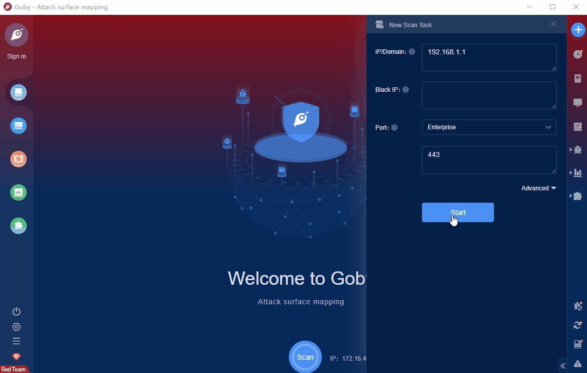

# Zyxel ZTP RCE (CVE-2022-30525)

Several firewalls, such as the Zyxel ATP series, VPN series, and USG FLEX series, have security vulnerabilities. An unauthenticated remote attacker could execute arbitrary code on the affected device as the user nobody, taking control of the server.

FOFA **query rule**: [title="USG FLEX" || title="USG20-VPN" || title="USG20W-VPN" || title="ATP100" || title="ATP200" || title="ATP500" || title="ATP700" || title="ATP800"](https://fofa.info/result?qbase64=dGl0bGU9IlVTRyBGTEVYIiB8fCB0aXRsZT0iVVNHMjAtVlBOIiB8fCB0aXRsZT0iVVNHMjBXLVZQTiIgfHwgdGl0bGU9IkFUUDEwMCIgfHwgdGl0bGU9IkFUUDIwMCIgfHwgdGl0bGU9IkFUUDUwMCIgfHwgdGl0bGU9IkFUUDcwMCIgfHwgdGl0bGU9IkFUUDgwMCI%3D)

# Demo

