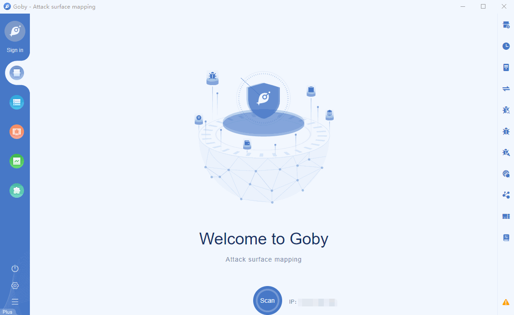

# CVE-2021-3019 lanproxy Directory Traversal

ffay lanproxy 0.1 allows Directory Traversal to read /../conf/config.properties to obtain credentials for a connection to the intranet.

**Affected version**: lanproxy 0.1

**[FOFA](https://fofa.so/result?q=header%3D%22Server%3A+LPS-0.1%22&qbase64=aGVhZGVyPSJTZXJ2ZXI6IExQUy0wLjEi&file=&file=) query rule**: header="Server: LPS-0.1"

# Demo

