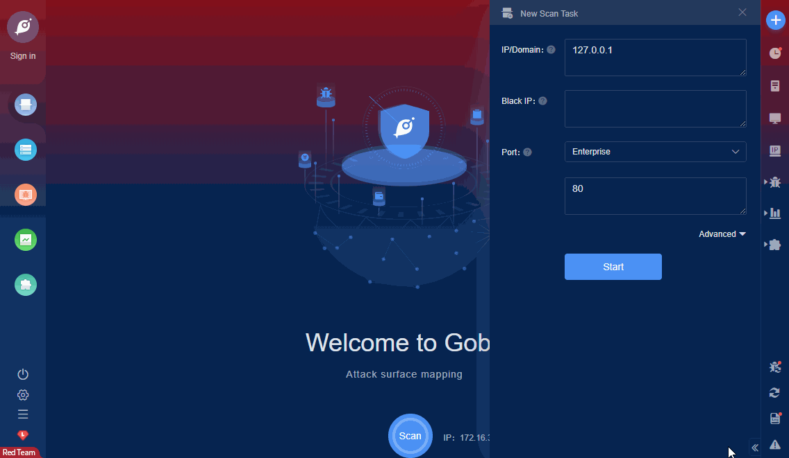

# qdPM 9.2 Database Information leakage

The password and connection string for the database are stored in a yml file. To access the yml file you can go to /core/config/databases.yml file and download.

FOFA **query rule**: [body="qdPM"](https://fofa.so/result?qbase64=Ym9keT0icWRQTSI%3D)

# Demo

