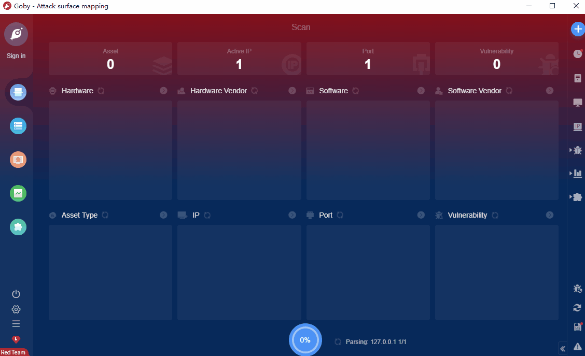

# ShuipFCMS authcode leak and RCE

Shuipfcms is a content management system based on ThinkPHP framework and developed by independent grouping. The vulnerability exists in shuipfcms, which can be exploited by an attacker to gain control of the server

**FOFA query rule**: [header="X-Powered-By: ShuipFCMS"](https://fofa.so/result?qbase64=aGVhZGVyPSJYLVBvd2VyZWQtQnk6IFNodWlwRkNNUyI%3D)

# Demo

