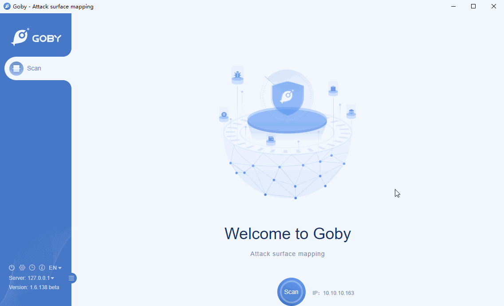

# CVE-2019-16759 vBulletin 5.x Remote Code Execution Vulnerability

vBulletin 5.x through 5.5.4 allows remote command execution via the widgetConfig[code] parameter in an ajax/render/widget_php routestring request.

**Affected version**: vBulletin 5.x - 5.5.4

**[FOFA](https://fofa.so/result?qbase64=YXBwPSJ2QnVsbGV0aW4i) query rule**: app="vBulletin"

# Demo

